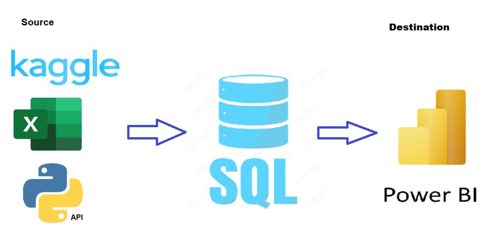
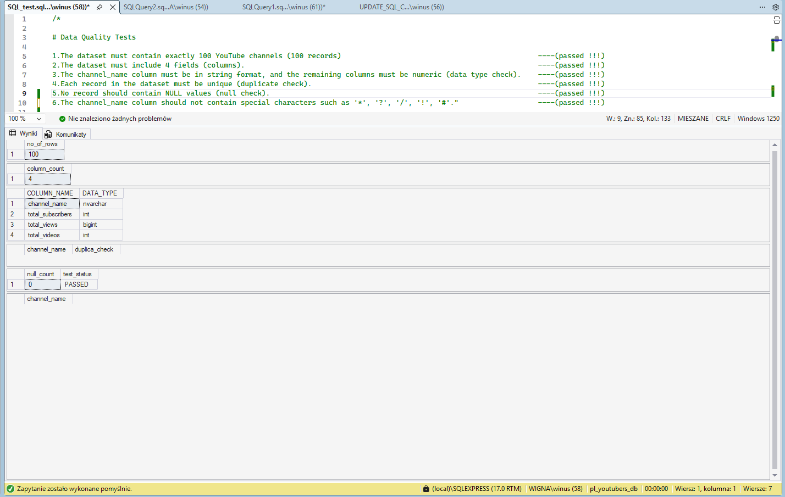

# # Data Portfolio: Excel to Power BI 


🏗️ Under Construction:


"I am currently enhancing this project by integrating advanced Power BI techniques, refined Excel configurations, and Python scripts for automated data processing. My focus is on elevating the visual storytelling and ensuring the technical architecture is robust and scalable."
😀😀😀

#Tabel of Concepts
--------
## Objective

### What is the key pain point?

The Head of Marketing wants to identify the top YouTubers in Poland in 2024 to determine which creators would be the most suitable for marketing campaigns throughout the rest of the year.
The dashboard integrates real-time 2026 data via the YouTube API to ensure up-to-date performance metrics.

### What is the ideal solution?

To create a dashboard that provides insights into the top Polish YouTubers in 2024, including:

- Subscriber count  
- Total views  
- Total videos  
- Engagement metrics  

This will help the marketing team make informed decisions about which YouTubers to collaborate with for their marketing campaigns.

#User story
As the Head of Marketing, I want to identify the top YouTubers in Poland based on subscriber count, videos uploaded and views accumulated, so that I can decide on which channels would be best to run marketing campaigns with to generate a good ROI. 

# Data Source

### What data is needed to achieve our objective?
We need data on the top YouTubers in Poland for 2024, including their:
* **Channel names**
* **Total subscribers**
* **Total views**
* **Total videos uploaded**

### Where is the data coming from? 
The data is sourced from **Kaggle** (via an Excel extract). You can find the original dataset here: [Kaggle YouTube Dataset](https://www.kaggle.com/datasets/bhavyadhingra00020/top-100-social-media-influencers-2024-countrywise?resource=download).

> **Note:** This project uses the 2024 Kaggle dataset as the baseline list of YouTube channels. Performance metrics—such as subscribers, views, and video counts—are dynamically updated using real-time **2026 data** fetched via the **YouTube API**.

## Stages

* **Design**
* **Development**
* **Testing**
* **Analysis**

## Dashboard Components Required

### What should the dashboard contain?
To determine the layout and functionality, the dashboard must answer the following key business questions:

- [ ] Who are the **top 10 YouTubers** with the most subscribers?
- [ ] Which **3 channels** have uploaded the most videos?
- [ ] Which **3 channels** have the most views?
- [ ] Which **3 channels** have the highest **average views** per video?
- [ ] Which **3 channels** have the highest **views per subscriber** ratio?
- [ ] Which **3 channels** have the highest **subscriber engagement rate** per video uploaded?

## Dashboard Mockup

### What should it look like?
To effectively answer our key questions, the dashboard will incorporate several data visualizations. The following components have been identified as appropriate for this project:

* **Table** – For detailed breakdowns of YouTuber metrics.
* **Treemap** – To visualize the distribution of subscribers or views across different categories.
* **Scorecards** – For high-level "at a glance" KPIs (e.g., total subscribers, total views).
* **Horizontal Bar Chart** – Ideal for ranking the top 10 channels and comparing performance.


## Tools

| Tool | Purpose |
| :--- | :--- |
| **Excel** | Initial data exploration and quick profiling. |
| **Python** | Fetching real-time data from the YouTube API. |
| **SQL Server** | Cleaning, testing, and performing in-depth data analysis. |
| **Power BI** | Visualizing the data through interactive dashboards. |
| **GitHub** | Project documentation hosting and version control. |
| **Canva** | Designing the high-fidelity mockup of the dashboard. |
| **Gemini AI** | Technical writing, code optimization, and documentation support. |

----
## Development

### Pseudocode

**What is the general approach in creating this solution from start to finish?**

1. **Get the Data** – Identify and collect the baseline dataset.
2. **Data Acquisition & Exploration** – Explore the data in **Excel** and fetch real-time metrics via the **YouTube API**.
3. **Data Ingestion** – Load the raw data into **SQL Server**.
4. **Data Cleaning** – Refine and format the data using **SQL** to ensure accuracy.
5. **Data Testing** – Run quality checks and validation scripts in **SQL**.
6. **Data Visualization** – Build interactive dashboards in **Power BI**.
7. **Insight Generation** – Analyze the visuals to generate findings and key takeaways.
8. **Documentation** – Write the technical documentation and project commentary
9. **Deployment** – Publish the final project and documentation to **GitHub Pages**.

------
## Data Exploration Notes

**Initial Observations & Observations:**

* **Data Sufficiency** – The dataset contains at least 4 key columns required for the analysis, meaning no additional data from the client is needed at this stage.
* **Format Issues** – Channel IDs in the first column are prefixed with an `@` symbol; these need to be cleaned to extract proper channel names.
* **Language & Localization** – Some headers and cell values are in a foreign language. These need to be evaluated for relevance and translated or handled accordingly.
* **Redundancy** – The dataset contains more information than required. Irrelevant columns will be removed to streamline the analysis.

## Data Cleaning

### Overview
The aim is to refine the dataset to ensure it is structured, accurate, and ready for analysis. The cleaned data must be lean, containing only the essential information required to answer our business questions.

### Constraints & Requirements
The cleaned dataset should meet the following criteria:
* **Relevance** – Only essential columns are retained.
* **Data Typing** – All data types must be appropriate for their respective content.
* **Data Integrity** – No column should contain null values; every record must be complete.

**Dataset Summary:**
| Property | Description |
| :--- | :--- |
| **Number of Rows** | 100 |
| **Number of Columns** | 4 |

### Expected Schema
| Column Name | Data Type | Nullable |Changes|
| :--- | :--- | :--- |:--- |
| channel_name | VARCHAR | NO | <span style="color: #4B0082;"> Changed data type from VARCHAR to NVARCHAR to support Unicode characters</span>
| total_subscribers | INTEGER | NO | -|
| total_views | INTEGER | NO | -|
| total_videos | INTEGER | NO | -|

### Cleaning Steps
To shape the data into the desired format, the following steps will be executed:
1. **Column Selection** – Filter out unnecessary columns and retain only the four required fields.
2. **String Manipulation** – Extract clean YouTube channel names from the primary column (removing the `@` prefix and IDs).
3. **Data Refinement** – Rename columns using clear, descriptive aliases for better readability in the final dashboard.

## Data Transformation (SQL)

To clean and shape the data, I developed the following SQL script. This creates a view that filters necessary columns, handles data types, and ensures data integrity by managing NULL values.

```sql
/*
Data Cleaning Steps:
1. Remove unnecessary columns by selecting only the required fields.
2. Extract clean YouTube channel names from the source string.
3. Handle NULL values in metrics using the COALESCE function to ensure calculation stability.
4. Rename columns for better readability and alignment with project standards.
5. Updated the data type of the channel_name column from VARCHAR to NVARCHAR to support Unicode (Cyrillic) characters.
*/

CREATE VIEW view_top_youtube_poland_2024 AS
SELECT 
    CAST(SUBSTRING(NAME, 1, CHARINDEX('@', NAME) - 1) AS NVARCHAR(100)) AS channel_name,
    COALESCE(total_subscribers, 0) AS total_subscribers,
    COALESCE(total_views, 0) AS total_views,
    COALESCE(total_videos, 0) AS total_videos
FROM 
    top_youtube_poland_2024;
```
#Testing

| Check | Description | Status |
| :--- | :--- | :--- |
| **Row Count** | The dataset must contain exactly 100 records. | ✅ Passed |
| **Column Count** | The dataset must include exactly 4 fields. | ✅ Passed |
| **Data Types** | `channel_name` must be a string; other metrics must be numeric. | ✅ Passed |
| **Uniqueness** | Each record must be unique (no duplicates). | ✅ Passed |
| **Null Check** | No record should contain NULL values. | ✅ Passed |
| **Invidal chanle_name**|The channel_name column should not contain special characters such as '*', '?', '/', '!', '#'."		----(failed !!!) | ✅ Passed |

Result:
❌ Test failed – invalid characters were detected.
Action Taken:
Additional analysis was performed to identify affected records.  See this record in Exels see that the name channeli is in cyricla :  SEE ISSUE 


## SQL Query	

```sql
--- 1.Row count check
SELECT 
	Count(*) no_of_rows
FROM 
	view_top_youtube_poland_2024

--- 2. Column count check 
SELECT 
	COUNT (*) as  column_count
FROM 
	INFORMATION_SCHEMA.COLUMNS
WHERE 
	TABLE_NAME = 'view_top_youtube_poland_2024'

--- 3. Data type check
SELECT 
	  COLUMN_NAME,
	  DATA_TYPE
FROM 
	INFORMATION_SCHEMA.COLUMNS
WHERE	
	TABLE_NAME = 'view_top_youtube_poland_2024'

--- 4. Duplicate check
SELECT 
	channel_name,
	COUNT(*)as duplica_check
FROM 
	view_top_youtube_poland_2024
GROUP BY 
	channel_name
HAVING 
	COUNT(*) >1

--- 5. null check
SELECT 
	COUNT(*) AS null_count,
	CASE 
        WHEN COUNT(*) = 0 THEN 'PASSED' 
        ELSE 'FAILED' 
    END AS test_status
FROM 
	view_top_youtube_poland_2024
WHERE	
	 total_subscribers IS NULL
	 OR total_views IS NULL
	 OR total_videos IS NULL;

--- 6. invidal chanle_name  check 
SELECT 
	channel_name
FROM 
	view_top_youtube_poland_2024
WHERE 
		channel_name LIKE '%?%' or
		channel_name LIKE '%!%' or
		channel_name LIKE '%/%' or
		channel_name LIKE '%*%' or
		channel_name LIKE '%#%' 
```

## Output



# Visualization
## Results
