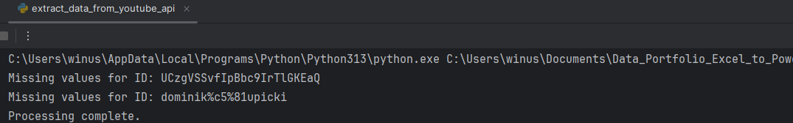
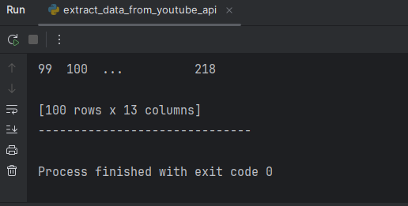
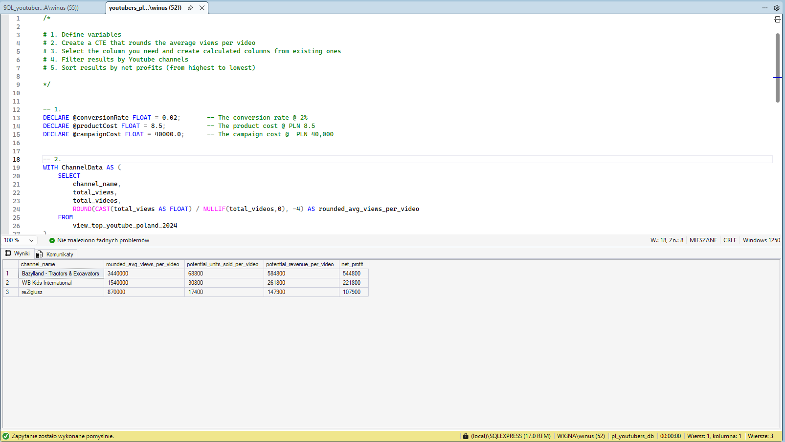
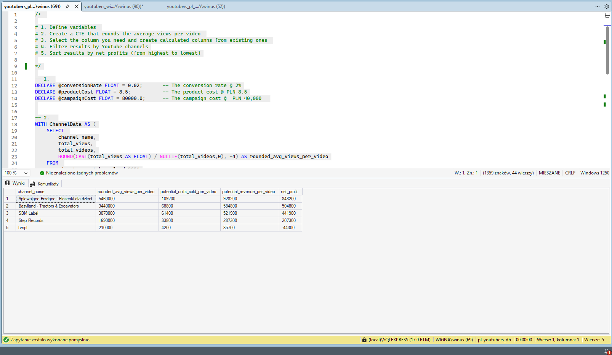

# # Data Portfolio: Excel to Power BI 


#Tabel of Concepts
--------
## Objective

### What is the key pain point?

The Head of Marketing wants to identify the top YouTubers in Poland in 2024 to determine which creators would be the most suitable for marketing campaigns throughout the rest of the year.
The dashboard integrates real-time 2026 data via the YouTube API to ensure up-to-date performance metrics.

### What is the ideal solution?

To create a dashboard that provides insights into the top Polish YouTubers in 2024, including:

- Subscriber count  
- Total views  
- Total videos  
- Engagement metrics  

This will help the marketing team make informed decisions about which YouTubers to collaborate with for their marketing campaigns.

#User story
As the Head of Marketing, I want to identify the top YouTubers in Poland based on subscriber count, videos uploaded and views accumulated, so that I can decide on which channels would be best to run marketing campaigns with to generate a good ROI. 

# Data Source

### What data is needed to achieve our objective?
We need data on the top YouTubers in Poland for 2024, including their:
* **Channel names**
* **Total subscribers**
* **Total views**
* **Total videos uploaded**

### Where is the data coming from? 
The data is sourced from **Kaggle** (via an Excel extract). You can find the original dataset here: [Kaggle YouTube Dataset](https://www.kaggle.com/datasets/bhavyadhingra00020/top-100-social-media-influencers-2024-countrywise?resource=download).

> **Note:** This project uses the 2024 Kaggle dataset as the baseline list of YouTube channels. Performance metrics—such as subscribers, views, and video counts—are dynamically updated using real-time **2026 data** fetched via the **YouTube API**.

## Stages

* **Design**
* **Development**
* **Testing**
* **Analysis**

## Dashboard Components Required

### What should the dashboard contain?
To determine the layout and functionality, the dashboard must answer the following key business questions:

- [ ] Who are the **top 10 YouTubers** with the most subscribers?
- [ ] Which **3 channels** have uploaded the most videos?
- [ ] Which **3 channels** have the most views?
- [ ] Which **3 channels** have the highest **average views** per video?
- [ ] Which **3 channels** have the highest **views per subscriber** ratio?
- [ ] Which **3 channels** have the highest **subscriber engagement rate** per video uploaded?

## Dashboard Mockup

### What should it look like?
To effectively answer our key questions, the dashboard will incorporate several data visualizations. The following components have been identified as appropriate for this project:

* **Table** – For detailed breakdowns of YouTuber metrics.
* **Treemap** – To visualize the distribution of subscribers or views across different categories.
* **Scorecards** – For high-level "at a glance" KPIs (e.g., total subscribers, total views).
* **Horizontal Bar Chart** – Ideal for ranking the top 10 channels and comparing performance.


## Tools

| Tool | Purpose |
| :--- | :--- |
| **Excel** | Initial data exploration and quick profiling. |
| **Python** | Fetching real-time data from the YouTube API. |
| **SQL Server** | Cleaning, testing, and performing in-depth data analysis. |
| **Power BI** | Visualizing the data through interactive dashboards. |
| **GitHub** | Project documentation hosting and version control. |
| **Canva** | Designing the high-fidelity mockup of the dashboard. |
| **Gemini AI** | Technical writing, code optimization, and documentation support. |

----
## Development

### Pseudocode

**What is the general approach in creating this solution from start to finish?**

1. **Get the Data** – Identify and collect the baseline dataset.
2. **Data Acquisition & Exploration** – Explore the data in **Excel** and fetch real-time metrics via the **YouTube API**.
3. **Data Ingestion** – Load the raw data into **SQL Server**.
4. **Data Cleaning** – Refine and format the data using **SQL** to ensure accuracy.
5. **Data Testing** – Run quality checks and validation scripts in **SQL**.
6. **Data Visualization** – Build interactive dashboards in **Power BI**.
7. **Insight Generation** – Analyze the visuals to generate findings and key takeaways.
8. **Documentation** – Write the technical documentation and project commentary
9. **Deployment** – Publish the final project and documentation to **GitHub Pages**.

------
## Data Exploration Notes

**Initial Observations & Observations:**

* **Data Sufficiency** – The dataset contains at least 4 key columns required for the analysis, meaning no additional data from the client is needed at this stage.
* **Format Issues** – Channel IDs in the first column are prefixed with an `@` symbol; these need to be cleaned to extract proper channel names.
* **Language & Localization** – Some headers and cell values are in a foreign language. These need to be evaluated for relevance and translated or handled accordingly.
* **Redundancy** – The dataset contains more information than required. Irrelevant columns will be removed to streamline the analysis.

## Data Cleaning

### Overview
The aim is to refine the dataset to ensure it is structured, accurate, and ready for analysis. The cleaned data must be lean, containing only the essential information required to answer our business questions.

### Constraints & Requirements
The cleaned dataset should meet the following criteria:
* **Relevance** – Only essential columns are retained.
* **Data Typing** – All data types must be appropriate for their respective content.
* **Data Integrity** – No column should contain null values; every record must be complete.

**Dataset Summary:**
| Property | Description |
| :--- | :--- |
| **Number of Rows** | 100 |
| **Number of Columns** | 4 |

### Expected Schema
| Column Name | Data Type | Nullable |Changes|
| :--- | :--- | :--- |:--- |
| channel_name | VARCHAR | NO | <span style="color: #4B0082;">Changed data type from VARCHAR to NVARCHAR to enable full Unicode support.</span> |
| total_subscribers | INTEGER | NO | -|
| total_views | INTEGER | NO | -|
| total_videos | INTEGER | NO | -|

### Cleaning Steps
To shape the data into the desired format, the following steps will be executed:
1. **Column Selection** – Filter out unnecessary columns and retain only the four required fields.
2. **String Manipulation** – Extract clean YouTube channel names from the primary column (removing the `@` prefix and IDs).
3. **Data Refinement** – Rename columns using clear, descriptive aliases for better readability in the final dashboard.

## Data Transformation (SQL)

To clean and shape the data, I developed the following SQL script. This creates a view that filters necessary columns, handles data types, and ensures data integrity by managing NULL values.

```sql
/*
Data Cleaning Steps:
1. Remove unnecessary columns by selecting only the required fields.
2. Extract clean YouTube channel names from the source string.
3. Handle NULL values in metrics using the COALESCE function to ensure calculation stability.
4. Rename columns for better readability and alignment with project standards.
5. Updated the data type of the channel_name column from VARCHAR to NVARCHAR to support Unicode (Cyrillic) characters.
*/

CREATE VIEW view_top_youtube_poland_2024 AS
SELECT 
    CAST(SUBSTRING(NAME, 1, CHARINDEX('@', NAME) - 1) AS NVARCHAR(100)) AS channel_name,
    COALESCE(total_subscribers, 0) AS total_subscribers,
    COALESCE(total_views, 0) AS total_views,
    COALESCE(total_videos, 0) AS total_videos
FROM 
    top_youtube_poland_2024;
```
#Testing

| Check | Description | Status |
| :--- | :--- | :--- |
| **Row Count** | The dataset must contain exactly 100 records. | ✅ Passed |
| **Column Count** | The dataset must include exactly 4 fields. | ✅ Passed |
| **Data Types** | `channel_name` must be a string; other metrics must be numeric. | ✅ Passed |
| **Uniqueness** | Each record must be unique (no duplicates). | ✅ Passed |
| **Null Check** | No record should contain NULL values. | ✅ Passed |
| **Invidal chanle_name**|The channel_name column should not contain special characters such as '*', '?', '/', '!', '#' | ✅ Passed |


## SQL Query	

```sql
--- 1.Row count check
SELECT 
	Count(*) no_of_rows
FROM 
	view_top_youtube_poland_2024

--- 2. Column count check 
SELECT 
	COUNT (*) as  column_count
FROM 
	INFORMATION_SCHEMA.COLUMNS
WHERE 
	TABLE_NAME = 'view_top_youtube_poland_2024'

--- 3. Data type check
SELECT 
	  COLUMN_NAME,
	  DATA_TYPE
FROM 
	INFORMATION_SCHEMA.COLUMNS
WHERE	
	TABLE_NAME = 'view_top_youtube_poland_2024'

--- 4. Duplicate check
SELECT 
	channel_name,
	COUNT(*)as duplica_check
FROM 
	view_top_youtube_poland_2024
GROUP BY 
	channel_name
HAVING 
	COUNT(*) >1

--- 5. null check
SELECT 
	COUNT(*) AS null_count,
	CASE 
        WHEN COUNT(*) = 0 THEN 'PASSED' 
        ELSE 'FAILED' 
    END AS test_status
FROM 
	view_top_youtube_poland_2024
WHERE	
	 total_subscribers IS NULL
	 OR total_views IS NULL
	 OR total_videos IS NULL;

--- 6. invidal chanle_name  check 
SELECT 
	channel_name
FROM 
	view_top_youtube_poland_2024
WHERE 
		channel_name LIKE '%?%' or
		channel_name LIKE '%!%' or
		channel_name LIKE '%/%' or
		channel_name LIKE '%*%' or
		channel_name LIKE '%#%' 
```

## Output


# Data Type Issue:
### 1.Issue: Missing Data during API Import

**Problem:**
Data loss occurred during the API statistics import process.


**Root Cause:**
The initial merge method used an **Inner Join**, which excluded rows where API data was missing or where the `channel_id` did not have a direct match. This resulted in the loss of 2 records.

**Solution:**
<span style="color: #4B0082;">**Implemented a Left Join in Python to ensure all original records are preserved.**</span>

```python
# Merge statistics back into the original DataFrame using a Left Join
# This ensures we keep all original rows even if API data is missing
merged_df = pd.merge(df, stats_df, on='channel_id', how='left')
```


### 2. Issue: Unicode Support (Cyrillic Characters)

**Problem:**
Incorrect encoding of Cyrillic characters (e.g., `Софунья Шалунья`, `Готовим дома`) due to `VARCHAR` data type.

**Root Cause:**
The `channel_name` column used `VARCHAR`, which lacks full Unicode compatibility.

**Solution:**
<span style="color: #4B0082;">**Changed data type from VARCHAR to NVARCHAR to enable full Unicode support.**</span>

**Result:**
Multilingual channel names are now stored and displayed correctly.

.png)

---

# Visualization
## Results
What does the dashboard look like?


## DAX Measures

### 1. Total Subscribers (M)
Calculates the total number of subscribers across all channels, scaled to millions.
```dax
Total Subscribers (M) = 
VAR million = 1000000
VAR sumOfSubscribers = SUM(view_top_youtube_poland_2024[total_subscribers])
VAR totalSubscribers = DIVIDE(sumOfSubscribers, million)

RETURN totalSubscribers
```
### 2. Total Views (B)
Calculates the total number of views across all channels, scaled to billions and rounded to two decimal places.
```dax
Total Views (B) = 
VAR billion = 1000000000
VAR sumOfTotalViews = SUM(view_top_youtube_poland_2024[total_views])
VAR totalViews = ROUND(sumOfTotalViews / billion, 2)

RETURN totalViews
```
### 3. Total Videos
Calculates the total number of videos uploaded by the YouTubers in the dataset.

```dax
Total Videos = 
VAR totalVideos = SUM(view_top_youtube_poland_2024[total_videos])

RETURN totalVideos
```

####  4. Average Views Per Video (M)
Calculates the average number of views per video, expressed in millions.

```dax
Average Views per Video (M) = 
VAR sumOfTotalViews = SUM(view_top_youtube_poland_2024[total_views])
VAR sumOfTotalVideos = SUM(view_top_youtube_poland_2024[total_videos])
VAR avgViewsPerVideo = DIVIDE(sumOfTotalViews, sumOfTotalVideos, BLANK())
VAR finalAvgViewsPerVideo = DIVIDE(avgViewsPerVideo, 1000000, BLANK())

RETURN finalAvgViewsPerVideo
```

###  5. Subscriber Engagement Rate
Measures the relationship between the number of subscribers and the total number of videos produced.

```dax
Subscriber Engagement Rate = 
VAR sumOfTotalSubscribers = SUM(view_top_youtube_poland_2024[total_subscribers])
VAR sumOfTotalVideos = SUM(view_top_youtube_poland_2024[total_videos])
VAR subscriberEngRate = DIVIDE(sumOfTotalSubscribers, sumOfTotalVideos, BLANK())

RETURN subscriberEngRate
```

### 6. Views per Subscriber
Calculates the average number of views generated per individual subscriber.

```dax
Views Per Subscriber = 
VAR sumOfTotalViews = SUM(view_top_youtube_poland_2024[total_views])
VAR sumOfTotalSubscribers = SUM(view_top_youtube_poland_2024[total_subscribers])
VAR viewsPerSubscriber = DIVIDE(sumOfTotalViews, sumOfTotalSubscribers, BLANK())

RETURN viewsPerSubscriber
```

----
 # Analysis
## Findings
What did we find?
For this analysis, we're going to focus on the questions below to get the information we need for our marketing client/boss :) 

Here are the key questions we need to answer for our marketing client:

**1.** Who are the top **10** YouTubers with the most subscribers?  

**2.** Which **3** channels have uploaded the most videos?  

**3.** Which **3** channels have the most views?  

**4.** Which **3** channels have the highest average views per video?  

**5.** Which **3** channels have the highest views per subscriber ratio?  

**6.** Which **3** channels have the highest subscriber engagement rate per video uploaded?  


 ### 1. Who are the top 10 YouTubers with the most subscribers?

| Rank | Channel Name                         | Subscribers |
|:----:|:-------------------------------------|------------:|
| 1    | Bazylland - Tractors & Excavators    | 7 420 000   |
| 2    | WB Kids International                | 6 870 000   |
| 3    | reZigiusz                            | 5 400 000   |
| 4    | Blowek                               | 5 390 000   |
| 5    | Софунья Шалунья                      | 4 050 000   |
| 6    | Step Records                         | 4 040 000   |
| 7    | Boomerang Polska                     | 3 570 000   |
| 8    | SBM Label                            | 3 460 000   |
| 9    | AbstrachujeTV                        | 3 370 000   |
| 10   | IsAmU                                | 2 850 000   |

### 2. Which 3 channels have uploaded the most videos?

| Rank | Channel Name | Videos Uploaded |
|:----:|:-------------|----------------:|
| 1    | tvnpl        | 20163           |
| 2    | TVN Series   | 13589           |
| 3    | Polsat       | 12077           |

### Which 3 channels have the most views?

| Rank | Channel Name                                   | Total Views (B)?????? |
|:----:|:-----------------------------------------------|----------------:|
| 1    | SBM Label                                      | 5,211,233,217   |
| 2    | Step Records                                   | 5,004,587,187   |
| 3    | Śpiewające Brzdące - Piosenki dla dzieci       | 4,673,061,131   |

### 4. Which 3 channels have the highest average views per video? 

| Rank | Channel Name                                   | Average Views per Video |
|:----:|:-----------------------------------------------|------------------------:|
| 1    | JuzzyGamePlay                                  | 37,250,000              |
| 2    | Sobel                                          | 17,840,000              |
| 3    | MINIVEVO                                       | 13,370,000              |

###5. Which 3 channels have the highest views per subscriber ratio?

| Rank | Channel Name                                   | Views per Subscriber |
|:-----|:-----------------------------------------------|---------------------:|
| 1    | Śpiewające Brzdące - Piosenki dla dzieci       | 1,825                |
| 2    | MINIVEVO                                       | 1,785                |
| 3    | tvnpl                                          | 1,607                |

### 6. Which 3 channels have the highest subscriber engagement rate per video uploaded?

| Rank | Channel Name | Subscriber Engagement Rate |
| :--- | :--- | :--- |
| 1 | Diana Milkanova | 640000 |
| 2 | DISCO MAREK | 354285 |
| 3 | JuzzyGamePlay | 111428 |

##  Notes 📝

For this analysis, we will prioritize metrics that are critical for generating the expected **ROI (Return on Investment)** for our marketing client. We will focus on identifying YouTube channels with the following attributes:

* **Most Subscribers:** To ensure broad brand reach.
* **Total Views:** To measure content resonance and audience retention.
* **Videos Uploaded:** To evaluate the consistency and activity level of the creator.
* 
---

## 📊 Validation:
## 1. Youtubers with the most subscribers
### Campaign Overview 
* **Product Placement Idea:** Consumer Electronics / Gadget
* **Conversion Rate:** 2% (0.02)
* **Product Cost:** 8.50 PLN
* **Campaign Cost (One-time fee):** 40,000.00 PLN

**Calculation breakdown:**

### 1. Bazylland - Tractors & Excavators
* **Average views per video:** 3.44M
* **Potential units sold:** 3,440,000 * 2% = **68,800 units**
* **Potential revenue:** 68,800 * 8.5 PLN = **584,800 PLN**
* **Net profit:** 584,800 - 40,000 = **544,800 PLN**

### 2. WB Kids International
* **Average views per video:** 1.54M
* **Potential units sold:** 1,540,000 * 2% = **30,800 units**
* **Potential revenue:** 30,800 * 8.5 PLN = **261,800 PLN**
* **Net profit:** 261,800 - 40,000 = **221,800 PLN**

### 3. reZigiusz
* **Average views per video:** 0.875M
* **Potential units sold:** 870,150, * 2% = **17,400 units**
* **Potential revenue:** 17,400 * 8.5 PLN = **147,900 PLN**
* **Net profit:** 147,90 - 40,000 = **107,900 PLN**

### ⚠️ Recommendations
Based on the subscriber-led analysis, **Bazylland - Tractors & Excavators** is the most profitable option, offering a potential net profit of **544,800 PLN** per video.

###  SQL query

```SQL
/* 

# 1. Define variables 
# 2. Create a CTE that rounds the average views per video 
# 3. Select the column you need and create calculated columns from existing ones 
# 4. Filter results by Youtube channels
# 5. Sort results by net profits (from highest to lowest)

*/

-- 1. 
DECLARE @conversionRate FLOAT = 0.02;		-- The conversion rate @ 2%
DECLARE @productCost FLOAT = 8.5;			-- The product cost @ PLN 8.5
DECLARE @campaignCost FLOAT = 40000.0;		-- The campaign cost @  PLN 40,000	

-- 2.  
WITH ChannelData AS (
    SELECT 
        channel_name,
        total_views,
        total_videos,
        ROUND(CAST(total_views AS FLOAT) / NULLIF(total_videos,0), -4) AS rounded_avg_views_per_video
    FROM 
        view_top_youtube_poland_2024
)

-- 3. 
SELECT 
    channel_name,
    rounded_avg_views_per_video,
    (rounded_avg_views_per_video * @conversionRate) AS potential_units_sold_per_video,
    (rounded_avg_views_per_video * @conversionRate * @productCost) AS potential_revenue_per_video,
    ((rounded_avg_views_per_video * @conversionRate * @productCost) - @campaignCost) AS net_profit
FROM 
    ChannelData

-- 4. 
WHERE 
    channel_name in ('Bazylland - Tractors & Excavators', 'WB Kids International', 'reZigiusz' )

-- 5.  
ORDER BY
	     net_profit DESC

```
### Output


## 2. Youtubers with the most videos uploaded
### Calculation breakdown

**Campaign Overview:**
* **Campaign Idea:** 10-video series sponsorship
* **Conversion Rate:** 2% (0.02)
* **Product Cost:** 8.50 PLN
* **Campaign Cost:** 45,000.00 PLN (4,500 PLN per video)

### a. tvnpl / Polsat
* **Average views per video:** 210,000
* **Potential units sold:** 210,000 * 2% = **4,200 units**
* **Potential revenue:** 4,200 * 8.5 PLN = **35,700 PLN**
* **Net profit:** 35,700 - 45,000 = **-9,300 PLN (Loss)**

### b. TVN Series
* **Average views per video:** 130,000
* **Potential units sold:** 130,000 * 2% = **2,600 units**
* **Potential revenue:** 2,600 * 8.5 PLN = **22,100 PLN**
* **Net profit:** 22,100 - 45,000 = **-22,900 PLN (Loss)**

### c. JASNA STRONA
* **Average views per video:** 110,000
* **Potential units sold:** 110,000 * 2% = **2,200 units**
* **Potential revenue:** 2,200 * 8.5 PLN = **18,700 PLN**
* **Net profit:** 18,700 - 45,000 = **-26,300 PLN (Loss)**

### d. Admiros
* **Average views per video:** 90,000
* **Potential units sold:** 90,000 * 2% = **1,800 units**
* **Potential revenue:** 1,800 * 8.5 PLN = **15,300 PLN**
* **Net profit:** 15,300 - 45,000 = **-29,700 PLN (Loss)**


### ⚠️ Recommendations
All channels in this category show a **negative ROI**. However, **TVN** and **Polsat** remain the most consistent uploaders. For these creators, a cross-media campaign (TV + YouTube) is recommended to build long-term reach rather than immediate sales profit. 
**Note:** 4th and 5th ranked channels are also unprofitable and lack significant performance in other metrics.

###  SQL query

```SQL
/* 
# 1. Define variables
# 2. Create a CTE that rounds the average views per video
# 3. Select the columns you need and create calculated columns from existing ones
# 4. Filter results by YouTube channels
# 5. Sort results by net profits (from highest to lowest)
*/

-- 1.
DECLARE @conversionRate FLOAT = 0.02;           -- The conversion rate @ 2%
DECLARE @productCost FLOAT = 8.5;               -- The product cost @ PLN 8.5 
DECLARE @campaignCostPerVideo FLOAT = 4500.0;   -- The campaign cost per video @ PLN 4,500
DECLARE @numberOfVideos INT = 10;               -- The number of videos (10)

-- 2.
WITH ChannelData AS (
    SELECT
        channel_name,
        total_views,
        total_videos,
        ROUND((CAST(total_views AS FLOAT) / total_videos), -4) AS rounded_avg_views_per_video
    FROM
        view_top_youtube_poland_2024
)

-- 3.
SELECT
    channel_name,
    rounded_avg_views_per_video,
    (rounded_avg_views_per_video * @conversionRate) AS potential_units_sold_per_video,
    (rounded_avg_views_per_video * @conversionRate * @productCost) AS potential_revenue_per_video,
    ((rounded_avg_views_per_video * @conversionRate * @productCost) - (@campaignCostPerVideo * @numberOfVideos)) AS net_profit
FROM
    ChannelData

-- 4.
WHERE
    channel_name IN ('tvnpl', 'TVN Series','Polsat','JASNA STRONA','Admiros')

-- 5.
ORDER BY
    net_profit DESC;
```

### Output


## 3. Youtubers with the most views
### Calculation breakdown

**Campaign Overview:**
* **Campaign Idea:** Influencer marketing
* **Conversion Rate:** 2% (0.02)
* **Product Cost:** 8.50 PLN
* **Campaign Cost:** 80,000.00 PLN

### a. Śpiewające Brzdące - Piosenki dla dzieci
* **Average views per video:** 5,460,000
* **Potential units sold:** 5,460,000 * 2% = **109,200 units**
* **Potential revenue:** 109,200 * 8.5 PLN = **928,200 PLN**
* **Net profit:** 928,200 - 80,000 = **848,200 PLN**

### b. Bazylland - Tractors & Excavators
* **Average views per video:** 3,440,000
* **Potential units sold:** 3,440,000 * 2% = **68,800 units**
* **Potential revenue:** 68,800 * 8.5 PLN = **584,800 PLN**
* **Net profit:** 584,800 - 80,000 = **504,800 PLN**

### c. SBM Label
* **Average views per video:** 3,070,000
* **Potential units sold:** 3,070,000 * 2% = **61,400 units**
* **Potential revenue:** 61,400 * 8.5 PLN = **521,900 PLN**
* **Net profit:** 521,900 - 80,000 = **441,900 PLN**

### d. Step Records
* **Average views per video:** 1,690,000
* **Potential units sold:** 1,690,000 * 2% = **33,800 units**
* **Potential revenue:** 33,800 * 8.5 PLN = **287,300 PLN**
* **Net profit:** 287,300 - 80,000 = **207,300 PLN**

### e. tvnpl
* **Average views per video:** 210,000
* **Potential units sold:** 210,000 * 2% = **4,200 units**
* **Potential revenue:** 4,200 * 8.5 PLN = **35,700 PLN**
* **Net profit:** 35,700 - 80,000 = **-44,300 PLN (Loss)**

### 💡 Recommendations

"Śpiewające Brzdące" has top ROI but wrong target audience (kids). "Bazylland" is the best strategic fit with positive ROI. Recommend a package deal for the top 3 channels to maximize collective returns and establish a long-term partnership.

For Tvn Recommend a cross-media campaign (TV + YouTube) to build long-term reach.

###  SQL query
```SQL
/* 

# 1. Define variables 
# 2. Create a CTE that rounds the average views per video 
# 3. Select the column you need and create calculated columns from existing ones 
# 4. Filter results by Youtube channels
# 5. Sort results by net profits (from highest to lowest)

*/

-- 1. 
DECLARE @conversionRate FLOAT = 0.02;		-- The conversion rate @ 2%
DECLARE @productCost FLOAT = 8.5;			-- The product cost @ PLN 8.5
DECLARE @campaignCost FLOAT = 80000.0;		-- The campaign cost @  PLN 40,000	

-- 2.  
WITH ChannelData AS (
    SELECT 
        channel_name,
        total_views,
        total_videos,
        ROUND(CAST(total_views AS FLOAT) / NULLIF(total_videos,0), -4) AS rounded_avg_views_per_video
    FROM 
        view_top_youtube_poland_2024
)

-- 3. 
SELECT 
    channel_name,
    rounded_avg_views_per_video,
    (rounded_avg_views_per_video * @conversionRate) AS potential_units_sold_per_video,
    (rounded_avg_views_per_video * @conversionRate * @productCost) AS potential_revenue_per_video,
    ((rounded_avg_views_per_video * @conversionRate * @productCost) - @campaignCost) AS net_profit
FROM 
    ChannelData

-- 4. 
WHERE 
    channel_name in ('SBM Label', 'Step Records', 'Śpiewające Brzdące - Piosenki dla dzieci', 'tvnpl', 'Bazylland - Tractors & Excavators')

-- 5.  
ORDER BY
	     net_profit DESC
```
### Output



---

## 📂 Resources & Further Analysis

For a more detailed breakdown and raw data, you can explore the following resources:

* **[ Excel Workbook](LINK_DO_TWOJEGO_FOLDERU)** – Contains all raw YouTube metrics and manual cleaning steps.
* **[SQL Scripts Folder](LINK_DO_PLIKU_SQL)** – Includes the queries used to extract and transform the data.

> **Note:** The Excel file provides a more granular view of the engagement rates and ROI projections.

# Discovery

## What did we learn?
We discovered that:
* **Bazylland - Tractors & Excavators**, **WB Kids International**, and **reZigiusz** are the channels with the most subscribers in Poland.
* **tvnpl**, **TVN Series**, and **Polsat** are the channels with the most videos uploaded, showing massive consistency but lower individual video reach.
* **SBM Label**, **Step Records**, and **Śpiewające Brzdące** are the channels with the highest total views, dominating the music and kids' entertainment sectors.
* **Entertainment and music channels** (like SBM Label or Sobel) generate the highest engagement and average views per video, making them ideal for high-visibility campaigns.
* **Traditional media outlets** (TVN, Polsat) show a negative ROI for simple product placements in our model due to high volume but lower average views per video.

## Recommendations
**What do you recommend based on the insights gathered?**
* **Bazylland - Tractors & Excavators** is the best channel to collaborate with for consumer electronics/gadgets to maximize immediate profit, as it has the highest subscriber count and a very strong net profit projection (**544,800 PLN**).
* Although **tvnpl** and **Polsat** are regular publishers, collaborating with them on a per-video basis is **not recommended** with current budget caps, as the potential ROI is currently negative. They are better suited for long-term brand awareness rather than direct sales.
* **Śpiewające Brzdące** is the best YouTuber to collaborate with for maximizing reach (highest views per subscriber), provided the product fits the "parent/child" demographic to maintain the expected conversion rate.
* The **top 3 channels** to form collaborations with for the best balance of reach and profit are **Bazylland**, **SBM Label**, and **reZigiusz**, as they consistently attract high engagement and show positive ROI in our projections.

## Potential ROI
**What ROI do we expect if we take this course of action?**
* Setting up a collaboration with **Bazylland** could generate a net profit of **544,800 PLN** per video.
* A partnership with **Śpiewające Brzdące** could see a potential net profit of **848,200 PLN**, assuming a successful demographic fit.
* An influencer marketing campaign with **SBM Label** is expected to bring a net profit of approximately **441,900 PLN** per video.
* Campaigns with **reZigiusz** offer a safer, high-engagement alternative with a projected net profit of **107,900 PLN**.

## Action Plan
**What course of action should we take and why?**
Based on our analysis, we believe the best channel to advance a long-term partnership deal with to promote the client’s products is the **Bazylland - Tractors & Excavators** channel.

**What steps do we take to implement the recommended decisions effectively?**
1. **Reach out** to the management teams behind each of these channels, starting with **Bazylland**.
2. **Negotiate contracts** within the budgets allocated (40,000 PLN - 80,000 PLN) to each marketing campaign.
3. **Kick off the campaigns** and track each of their performances against the 2% conversion KPI.
4. **Review performance**, gather insights, and optimize based on feedback from converted customers and each channel’s audience before expanding to other creators.


---

# The End
**Thank you** for taking the time to view and read this project! I hope the insights gathered are valuable.

**Have a great day! / Miłego dnia!** 😊

---
**Inspiration:** This project was inspired by the [sdw-online/top_uk_youtubers_2024] (https://github.com/sdw-online/top_uk_youtubers_2024/tree/main)study.


